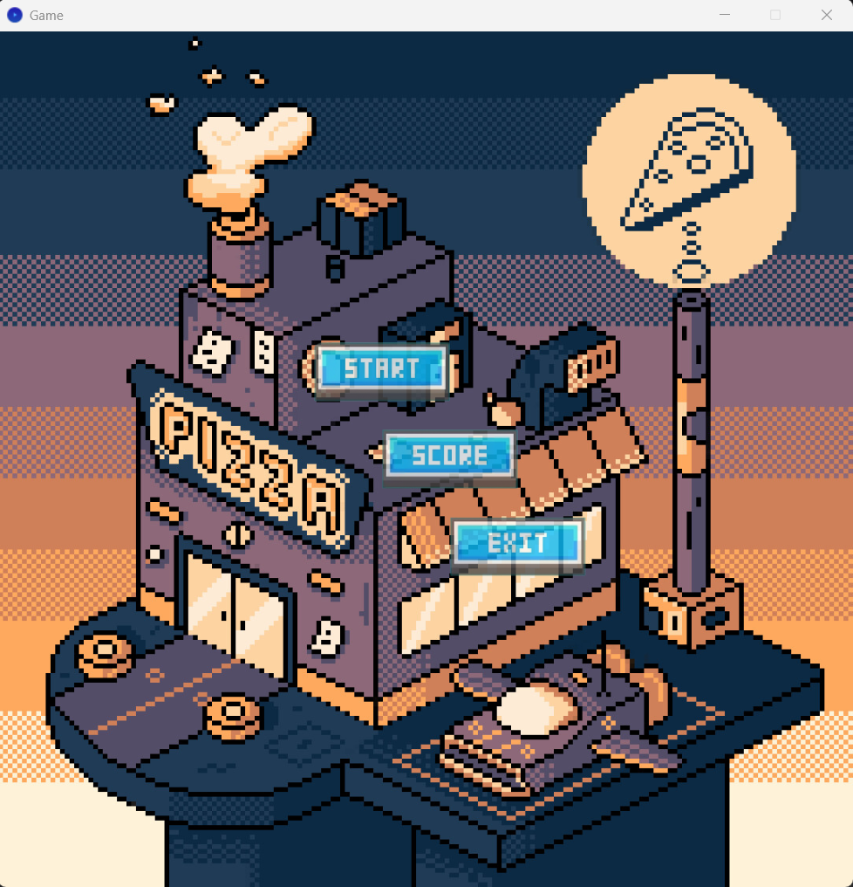
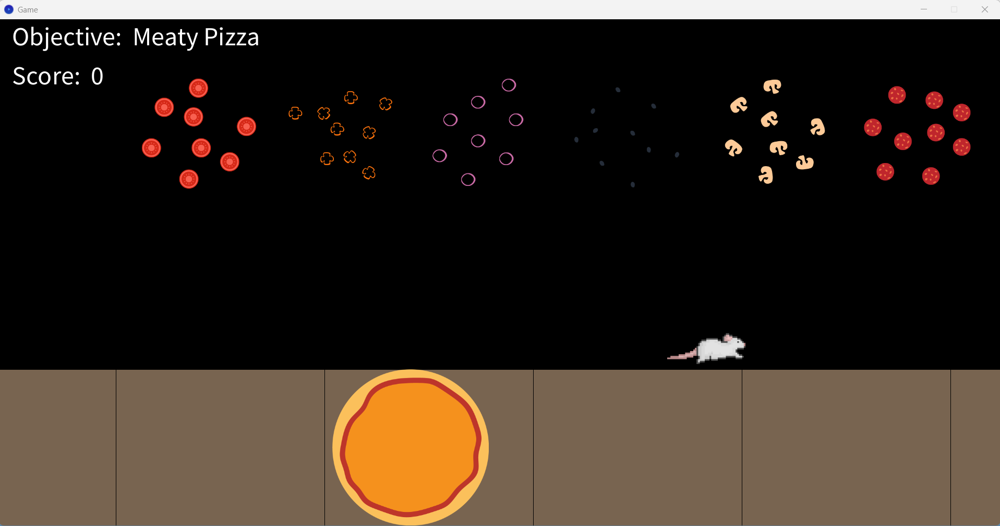
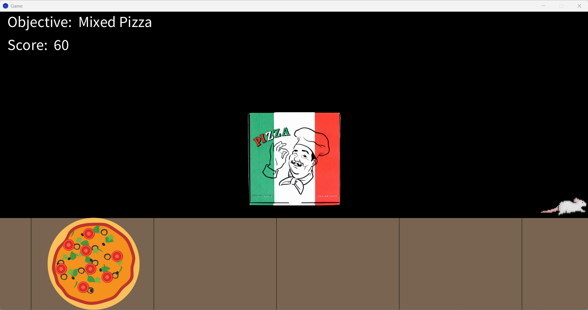
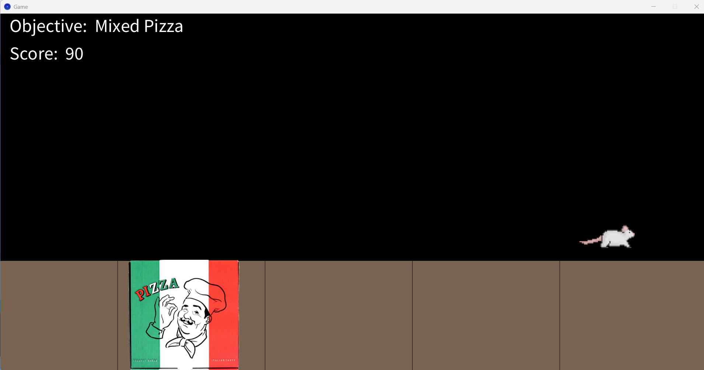
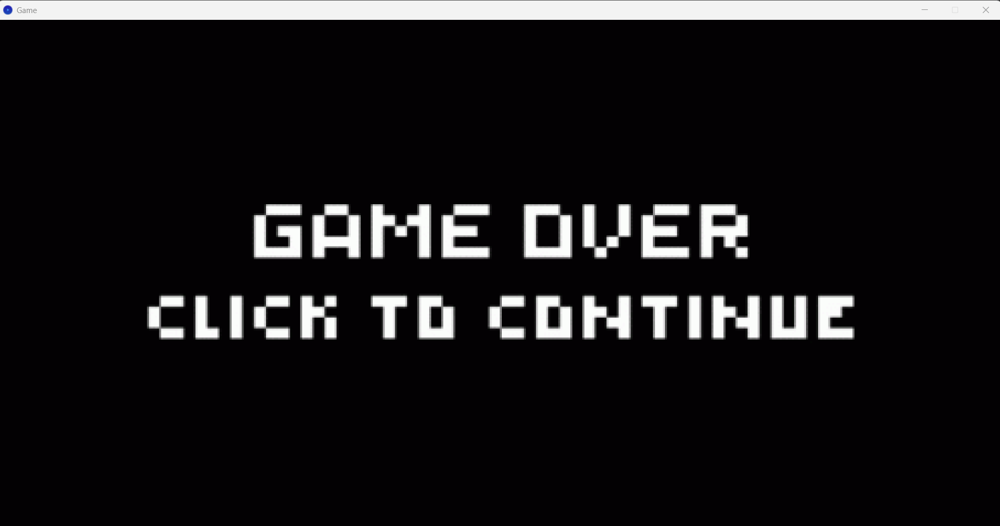
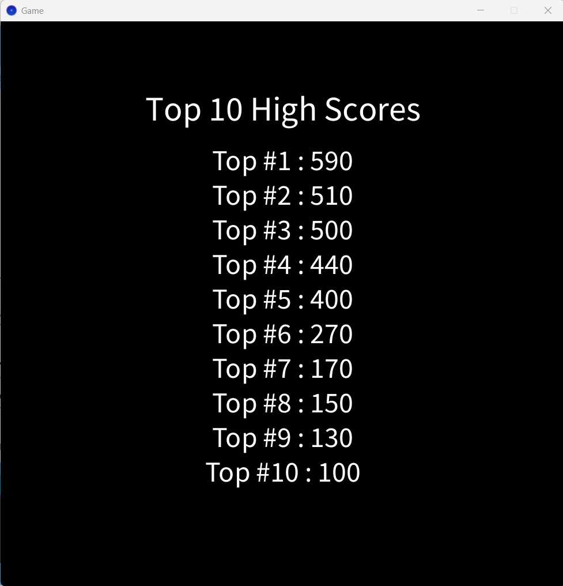

🍕 Pizza Factory Game

📌 Overview

Pizza Factory Game is a Processing-based simulation where players assemble pizzas on a conveyor belt. It features real-time animations, physics-based toppings, and a dynamic scoreboard.

🚀 Features

🏫 Animated Conveyor Belt – Moves pizzas continuously from right to left.

🍕 Topping Interaction – Players drag and drop toppings onto the pizza.

🎯 Scoring System – Earn points based on correct topping placement.

⚡ Game Difficulty Scaling – Speed increases as the game progresses.

🐭 Avoid Obstacles – Rats appear and must be dodged.

⚙️ Technical Details

1️⃣ Object-Oriented Design

The game follows an OOP approach, breaking functionality into multiple classes:

Conveyor_Belt.pde – Handles conveyor belt animation.

Pizza.pde – Manages pizza rendering and topping logic.

Scoreboard.pde – Saves and sorts scores.

Menu.pde – Handles UI and button interactions.

Rat.pde – Controls enemy movement and animations.

Pizza_Box.pde – Handles pizza box mechanics and bonus scoring.

Toppings.pde – Manages topping movement and interactions.

Difficulty_Listener.pde – Adjusts game difficulty dynamically.

Game.pde – Core game loop and logic.

Rotation.pde – Handles rotation mechanics for draggable objects.

2️⃣ Game State Management

The game uses a finite state machine with the following states:

START_SCREEN

GAMEPLAY

SCOREBOARD

GAME_OVER

State changes are triggered by user input (mouse clicks on buttons).

void draw() {
    if (gameState == START_SCREEN) {
        drawStartScreen();
    } else if (gameState == GAMEPLAY) {
        updateGame();
    } else if (gameState == SCOREBOARD) {
        drawScoreboard();
    } else if (gameState == GAME_OVER) {
        drawGameOverScreen();
    }
}

3️⃣ Collision Detection & Drag Mechanics

Topping Collision: Checks if a topping is correctly placed on the pizza.

Pizza Box Collision: Ensures the box is upright before placing the pizza.

Mouse Drag & Drop: Handles player interaction.

void checkCollisionWithPizzaBase() {
  float boxLeft = x - pizzaBoxImage.width / 2;
  float boxRight = x + pizzaBoxImage.width / 2;
  float boxTop = y - pizzaBoxImage.height / 2;
  float boxBottom = y + pizzaBoxImage.height / 2;

  float baseLeft = pizza.x;
  float baseRight = pizza.x + pizza.pizzaBase.width;
  float baseTop = pizza.y;
  float baseBottom = pizza.y + pizza.pizzaBase.height;

  if (boxRight > baseLeft && boxLeft < baseRight && boxBottom > baseTop && boxTop < baseBottom) {

    float centerX = (baseLeft + baseRight) / 2;
    float centerY = (baseTop + baseBottom) / 2;

    x = centerX;
    y = centerY;

  }
}

4️⃣ Sorting Algorithm for Scoreboard

The leaderboard stores scores in a text file and sorts them using Insertion Sort.

int[] insertNumberToArray(int[] intArray, int number) {
  int[] newIntArray = new int[intArray.length + 1];
  int i = 0;
  while (i < intArray.length && number < intArray[i]) {
    newIntArray[i] = intArray[i];
    i++;
  }
  newIntArray[i] = number;
  for (int j = i; j < intArray.length; j++)
    newIntArray[j + 1] = intArray[j];
  return newIntArray;
}

5️⃣ File Handling for Score Saving

The game writes and reads scores from a text file, ensuring scores persist.

void saveHighScore(int score) {
  this.highScore = score;

  String[] lines = loadStrings("Assets/Scoreboard/scoreboard.txt");
  int[] numbers = convertArrayStrToInt(lines);

  numbers = insertNumberToArray(numbers, score);

  lines = convertArrayIntToStr(numbers);

  saveStrings("Assets/Scoreboard/scoreboard.txt", lines);
}

🗂 Project Structure

Pizza-Factory-Game/
│── Assets/                 # Images, sounds, and textures
│── Conveyor_Belt.pde       # Handles conveyor belt animation
│── Difficulty_Listener.pde # Adjusts game difficulty dynamically
│── Game.pde                # Core game logic (main loop)
│── Menu.pde                # UI and button interactions
│── Pizza.pde               # Pizza rendering and topping logic
│── Pizza_Box.pde           # Handles pizza box mechanics
│── Rat.pde                 # Enemy (Game Over condition)
│── Rotation.pde            # Rotation mechanics for draggable objects
│── Scoreboard.pde          # Score saving and sorting logic
│── sketch.properties       # Processing IDE configuration
│── Toppings.pde            # Manages topping movement and interactions
│── README.md               # Project overview and technical details

🛠 Installation

Clone the repository:

git clone https://github.com/Yousaer10/Pizza-Factory-Game.git

Open Processing IDE and run Main.pde.

🖼 Screenshots

